# DroneCV

Running a binary classifier on images of CX-OF drones to assist in a real-time object tracker. Runs Keras with VGG features on a tensorflow backend.

## Methods

Before training a classifier, a labeled dataset must be created where one contains images of our CX-OF drone and the other doesn't. A color thresholding OpenCV script created by Brian Liao cut bounding boxes around videos that were either found online or recorded in the office. Recording our own video involved flying the drone at multiple heights while rotating it about its vertical axis to expose all sides of the drone. Our dataset was then extracted from the frames.

The "not-drone" dataset was collected from ImageNet.
The validation set was constructed by splitting 20% of our images at random.

The above methods produced thousands of images, which is not enough to for our model. Therefore real-time data augmentation is applied to the images that randomly rotate, scale, and flip horizontally the images of our drone.

With the dataset, it was decided to use the pre-trained VGG16 model as a feature extractor. The original architecture was taken from [JGuillaumin](https://github.com/keras-team/keras/issues/4465). After overnight training the training loss does not converge even for the training set. The next attempt used only 10 images for each the drone and not-drone classes and the model was still unable to overfit. This strange behavior was fixed by removing both fully connected ReLU layers in the architecture and freezing the VGG layers from being trained. With this modification the model effectively performs binary softmax regression on VGG features. Unexpectedly, after 10 minutes of training on the Nvidia GTX 1080, both the training and validation accuracy reach 100%. This behavior is likely due to the high similarity between all frames in the videos, so our validation set is too similar to our training set despite being selected at random.

A new labeled dataset containing 100 images of drones was created by Brian Liao, and it is found that the model only gets 80% accuracy on this dataset. Failure cases involve images with significant occlusion, top-down or bottom-up views of the drone, and views that include the top of the drone when the drone color scheme is red (our training set drones are blue).

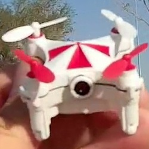 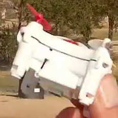
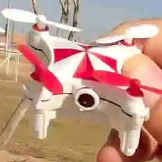
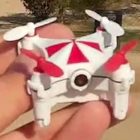
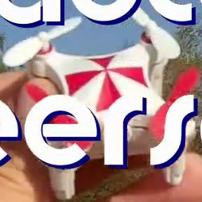
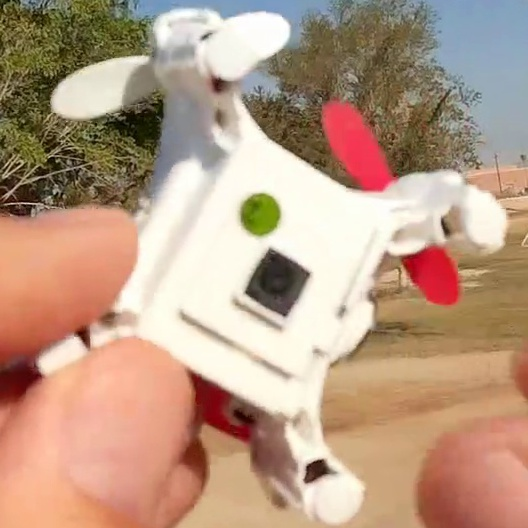
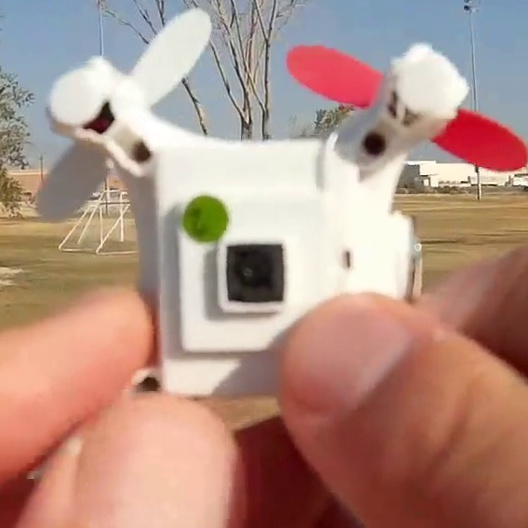
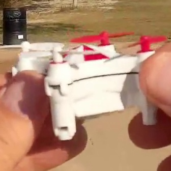
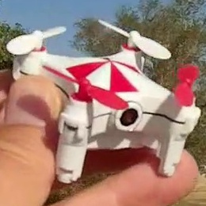
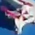
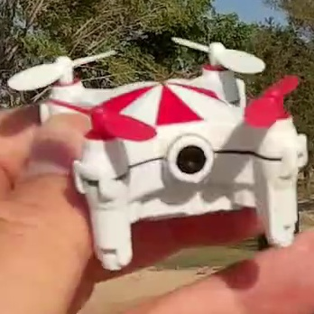
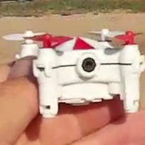
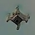
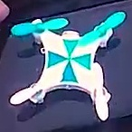
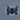
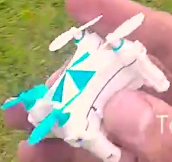
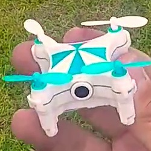
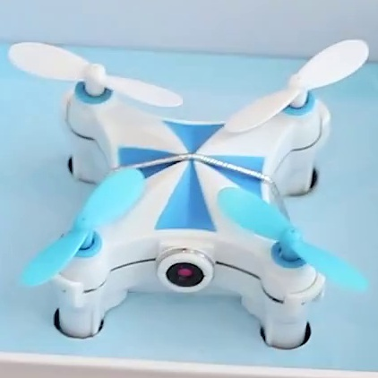
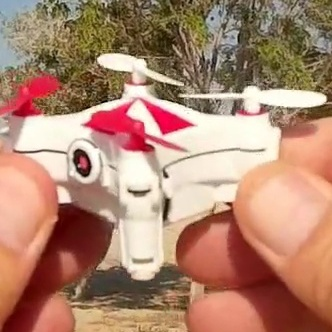

## Authors

* **Chandler Chen** - *Initial work* - [SquareMouse](https://github.com/SquareMouse/)
